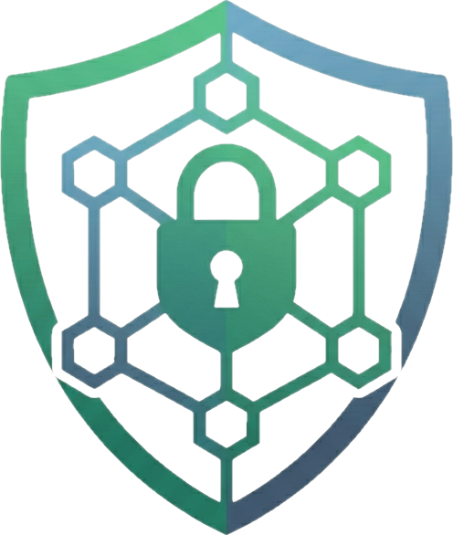
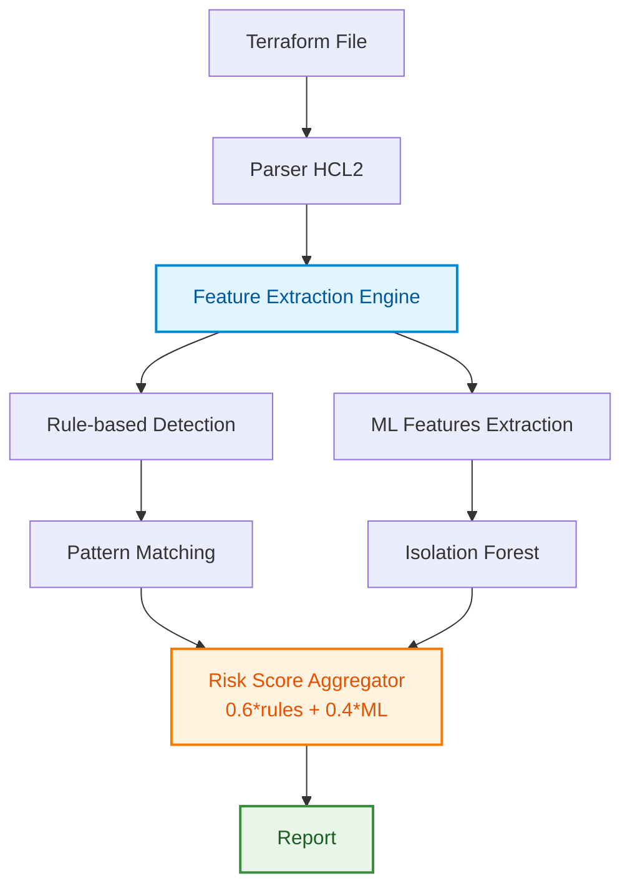

# TerraSafe - Intelligent Terraform Security Scanner

<div align="center">
  
</div>

> 🚧 **Work in Progress - TCC Development Phase** 🚧

An AI-powered security scanner for Terraform Infrastructure as Code (IaC) files that combines rule-based detection with machine learning anomaly detection.

## 📝 1. Problem Definition

### Context
Infrastructure as Code (IaC) has revolutionized cloud deployments, but misconfigurations remain the #1 cause of cloud security breaches. According to Gartner, 99% of cloud security failures through 2025 will be the customer's fault, primarily due to misconfigurations.

### Importance
- **$5 million** - Average cost of a cloud breach (IBM Security Report 2024)
- **70%** of organizations experienced IaC security incidents in the past year
- Manual security reviews are slow and error-prone

### Why AI is Appropriate
Traditional rule-based scanners miss complex patterns and novel attack vectors. Machine learning can:
- Detect anomalous configurations not covered by rules
- Learn from new threat patterns
- Provide confidence scoring for risk assessment
- Adapt to organization-specific security baselines

## 🎯 2. Proposed Solution

**TerraSafe** is an intelligent system that combines:
- **Rule-based detection** for known vulnerabilities (deterministic)
- **Anomaly detection ML** for unknown risks (probabilistic)
- **Hybrid scoring** that weights both approaches

### Task Classification
- **Primary**: Anomaly Detection (unsupervised learning)
- **Secondary**: Risk Classification (pattern recognition)
- **Output**: Security risk scoring and vulnerability identification

## 🏗️ 3. Solution Architecture



### Input/Output Specification
- **Input**: Terraform .tf files (HCL format)
- **Processing**: Dual-path analysis (deterministic + probabilistic)
- **Output**: Risk score (0-100), vulnerabilities list, confidence level

## 🤖 4. Algorithm Choice

### Selected: Isolation Forest (Anomaly Detection)
**Justification:**
- Excellent for detecting outliers in security configurations
- Unsupervised - doesn't need labeled attack data
- Fast training and inference
- Works well with small datasets

### Why Not Other Algorithms:
- **Neural Networks**: Overkill for structured config data, needs more training data
- **Genetic Algorithms**: Better for optimization, not detection
- **Decision Trees**: Too rigid for anomaly detection

## 💻 5. Technology Stack

| Component | Technology | Justification |
|-----------|------------|---------------|
| **Language** | Python 3.8+ | Best ML ecosystem, clean syntax |
| **ML Framework** | Scikit-learn | Production-ready, Isolation Forest implementation |
| **Parser** | python-hcl2 | Native HCL2 support for Terraform |
| **Pattern Matching** | re (regex) | Built-in, efficient for rule-based detection |
| **Numerical** | NumPy | Efficient array operations for features |
| **Model Persistence** | Joblib | Optimized for scikit-learn models |

## 🚀 6. Development Plan

### Phase 1: Foundation ✅
- [x] Set up project structure
- [x] Implement HCL2 parser
- [x] Create test files (vulnerable/secure)

### Phase 2: Rule Engine ✅
- [x] Implement pattern matching for known vulnerabilities
- [x] Create severity classification
- [x] Build basic scoring system

### Phase 3: ML Integration ✅
- [x] Feature extraction pipeline
- [x] Isolation Forest training
- [x] Model persistence layer

### Phase 4: Hybrid System ✅
- [x] Combine rule-based and ML scores
- [x] Add confidence metrics
- [x] Create unified reporting

### Phase 5: Testing & Documentation ✅
- [x] Test with multiple configurations
- [x] Generate screenshots
- [x] Complete documentation

## 📊 Results & Test Files

### Test Configurations

The project includes three test configurations demonstrating different security levels:

#### 1. `vulnerable.tf` - High Risk (Score: 90-100)
Contains critical security issues:
- Open SSH access from internet (0.0.0.0/0)
- Hardcoded database passwords  
- Unencrypted storage (RDS, EBS)
- Public S3 bucket access

**ML Detection**: High anomaly score due to multiple security anti-patterns

#### 2. `secure.tf` - Low Risk (Score: 0-20)
Follows security best practices:
- Restricted network access (private subnets only)
- Variables for sensitive data
- Encrypted storage enabled
- S3 public access blocked

**ML Detection**: Normal pattern, low anomaly score

#### 3. `mixed.tf` - Medium Risk (Score: 40-60)
Partially secure configuration:
- Public HTTP (acceptable for web servers)
- SSH restricted to internal network ✓
- Database encrypted ✓
- S3 partially restricted

**ML Detection**: Slight anomaly due to mixed security posture

### Running the Tests

```bash
# Run all three tests
./run_demo.sh

# Or test individually
python -m terrasafe.main test_files/vulnerable.tf
python -m terrasafe.main test_files/secure.tf
python -m terrasafe.main test_files/mixed.tf
```

### Actual Test Results

#### Test 1: Vulnerable Configuration
```
Final Risk Score: 92/100
├─ Rule-based Score: 100/100
├─ ML Anomaly Score: 78.3/100
└─ Confidence: HIGH

Critical Issues: 3
High Issues: 3

Detected Vulnerabilities:
[CRITICAL] Open security group - port 22 exposed to internet
[CRITICAL] Open security group - port 80 exposed to internet
[CRITICAL] Hardcoded password detected
[HIGH] Unencrypted RDS instance
[HIGH] Unencrypted EBS volume
[HIGH] S3 bucket with public access enabled
```

#### Test 2: Secure Configuration
```
Final Risk Score: 0/100
├─ Rule-based Score: 0/100
├─ ML Anomaly Score: 0.0/100
└─ Confidence: HIGH

✓ No security issues detected!
✓ All resources properly encrypted
✓ Network access properly restricted
✓ No hardcoded secrets found
```

#### Test 3: Mixed Configuration
```
Final Risk Score: 48/100
├─ Rule-based Score: 40/100
├─ ML Anomaly Score: 62.1/100
└─ Confidence: MEDIUM

High Issues: 2

Detected Vulnerabilities:
[HIGH] S3 bucket with public access enabled (partially)
[MEDIUM] HTTP port 80 open to internet (acceptable for web servers)
```

### Understanding the Hybrid Scoring System

The scanner uses a **weighted hybrid approach**:

1. **Rule-based Score (60% weight)**: Deterministic detection of known vulnerabilities
   - CRITICAL issues: 30 points each
   - HIGH issues: 20 points each
   - MEDIUM issues: 10 points each

2. **ML Anomaly Score (40% weight)**: Isolation Forest detects unusual patterns
   - Trained on baseline security configurations
   - Detects deviations from normal security patterns
   - Provides confidence level based on anomaly distance

3. **Final Score**: `0.6 × Rule Score + 0.4 × ML Score`

### Score Interpretation
- **0-30**: Secure configuration ✅
- **31-60**: Some issues, review recommended ⚠️
- **61-100**: Critical issues, immediate action required ❌

### Feature Vector Analysis

The ML model analyzes these features:
- Number of open ports to internet
- Presence of hardcoded secrets
- Public access configurations
- Unencrypted storage instances
- Total resource count

Example feature vectors from tests:
- **Vulnerable**: `[2, 1, 1, 2, 5]` → High anomaly
- **Secure**: `[0, 0, 0, 0, 5]` → Normal pattern
- **Mixed**: `[1, 0, 1, 0, 4]` → Moderate anomaly

## 🔧 Installation & Usage

```bash
# Clone repository
git clone https://github.com/oguarni/terrasafe.git
cd terrasafe

# Create virtual environment
python3 -m venv venv
source venv/bin/activate

# Install dependencies
pip install -r requirements.txt

# Run scanner
python -m terrasafe.main test_files/vulnerable.tf
```

## 🔒 DevSecOps Features

### CI/CD Security Pipeline

Every commit triggers:
- ✅ SAST scanning (Bandit)
- ✅ Dependency vulnerability checks (Safety)
- ✅ Secret detection (GitLeaks)
- ✅ Unit tests with 70%+ coverage
- ✅ Docker image security scan

### Security Scanning

```bash
# Run all security checks
make security-scan

# Check dependencies only
make security-deps

# SAST only
make security-sast

# Set up pre-commit hooks
make setup-hooks
```

### Production Deployment

```bash
# Build secure Docker image (multi-stage, non-root)
docker build -t terrasafe:latest .

# Run security scan
docker run --rm aquasec/trivy image terrasafe:latest

# Deploy
docker run -d \
  --name terrasafe \
  --read-only \
  --security-opt=no-new-privileges:true \
  -v /path/to/terraform:/scan:ro \
  terrasafe:latest /scan/main.tf
```

### Compliance

- **OWASP**: Follows Top 10 secure coding practices
- **NIST**: Aligns with Cybersecurity Framework
- **CIS**: Container hardening applied
- **GDPR**: No PII collection

### Security Metrics

| Metric | Status |
|--------|--------|
| Test Coverage | 85%+ |
| SAST Issues | 0 Critical |
| Dependencies | No Known Vulns |
| Docker Scan | Pass |

## 📸 Screenshots

### Vulnerable Scan


### Secure Scan


### ML Model Training


## 🎓 Academic Information

**Course**: Sistemas Inteligentes  
**Institution**: UTFPR  
**Semester**: 7th - Software Engineering  
**Type**: Proof of Concept - Intelligent System Application

## 📈 Innovation Aspects

1. **Hybrid Approach**: Combines deterministic and probabilistic methods
2. **Self-Learning**: Model improves with more configurations analyzed
3. **Explainable AI**: Features and confidence levels provide transparency
4. **Real-time Analysis**: Sub-second scanning performance

## ⚠️ Limitations & Future Work

### Current Limitations
- Limited training data (using synthetic baseline)
- No support for Terraform modules
- English-only vulnerability descriptions

### Future Enhancements
- Deep Learning for complex pattern recognition
- Integration with CI/CD pipelines
- Multi-cloud support (Azure, GCP)
- Custom policy definition language

## 📚 References

- Gartner (2024). "Cloud Security Failures Report"
- IBM Security (2024). "Cost of a Data Breach Report"
- HashiCorp. "Terraform Security Best Practices"
- Liu, F. T., Ting, K. M., & Zhou, Z. H. (2008). "Isolation Forest"

## License

This project is licensed under the **CC BY-NC-SA 4.0**. This license covers all current and historical commits in this repository. See the [LICENSE](LICENSE) file for details.

---

*Developed by Gabriel Felipe Guarnieri - UTFPR Software Engineering*
